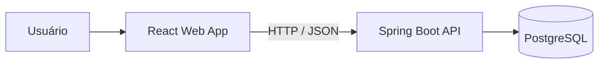

# 👔 Suit Rental Manager Web

<p align="center">
  Dashboard web para gerenciar clientes, produtos, estoque físico e locações de trajes sociais.
</p>

<p align="center">
  
  
  
  
</p>

<p align="center">
  <a href="https://suit-rental-manager-web.vercel.app"><strong>🌐 Acessar aplicação</strong></a>
  &nbsp;•&nbsp;
  <a href="https://github.com/branquinho91/suit-rental-manager-api"><strong>⚙️ Ver API</strong></a>
</p>

<p align="center">
  <a href="#-sobre-o-projeto">Sobre</a> •
  <a href="#-funcionalidades">Funcionalidades</a> •
  <a href="#%EF%B8%8F-tecnologias">Tecnologias</a> •
  <a href="#-executando-localmente">Como executar</a> •
  <a href="#-integração-com-a-api">Integração</a>
</p>

## ✨ Sobre o projeto

O **Suit Rental Manager** é um sistema full stack criado para simplificar a operação diária de lojas de aluguel de roupas sociais. Esta aplicação é a interface web do sistema e concentra, em um único painel, o cadastro de clientes e produtos, o controle individual das peças e o acompanhamento das locações.

O ecossistema é dividido em dois repositórios:

| Projeto | Repositório                                                                        | Responsabilidade                                 |
| ------- | ---------------------------------------------------------------------------------- | ------------------------------------------------ |
| **Web** | [suit-rental-manager-web](https://github.com/branquinho91/suit-rental-manager-web) | Interface e experiência do usuário em React      |
| **API** | [suit-rental-manager-api](https://github.com/branquinho91/suit-rental-manager-api) | Regras de negócio, persistência e endpoints REST |

> A versão publicada está disponível em [suit-rental-manager-web.vercel.app](https://suit-rental-manager-web.vercel.app).

## 🚀 Funcionalidades

- **Clientes** — cadastro e busca por nome, CPF, e-mail, telefone ou cidade.
- **Produtos** — catálogo com tipo, marca, tamanho, cor, preço e observações.
- **Estoque** — inclusão de peças físicas, códigos individuais e acompanhamento de disponibilidade.
- **Locações** — criação de locações com um ou mais itens e visualização dos detalhes.
- **Ciclo da locação** — conclusão ou cancelamento de locações ativas.
- **Busca rápida** — filtros específicos nas telas de clientes, produtos, estoque e locações.
- **Feedback visual** — estados de carregamento, erro, lista vazia e nenhum resultado encontrado.
- **Navegação SPA** — rotas no cliente com suporte a acesso direto quando publicada na Vercel.

## 🛠️ Tecnologias

| Tecnologia                                      | Uso no projeto                                  |
| ----------------------------------------------- | ----------------------------------------------- |
| [React 19](https://react.dev/)                  | Construção da interface por componentes         |
| [TypeScript 6](https://www.typescriptlang.org/) | Tipagem estática e segurança no desenvolvimento |
| [Vite 8](https://vite.dev/)                     | Servidor de desenvolvimento e build de produção |
| [React Router 7](https://reactrouter.com/)      | Navegação entre as telas da aplicação           |
| [ESLint](https://eslint.org/)                   | Qualidade e padronização do código              |
| [Vercel](https://vercel.com/)                   | Hospedagem da aplicação web                     |

## 🧩 Arquitetura



No frontend, as responsabilidades estão separadas entre páginas, componentes reutilizáveis, serviços de integração, tipos e funções utilitárias.

## 🏁 Executando localmente

### Pré-requisitos

- [Node.js](https://nodejs.org/) em uma versão LTS atual
- [npm](https://www.npmjs.com/)
- [Suit Rental Manager API](https://github.com/branquinho91/suit-rental-manager-api) em execução

### 1. Clone o projeto

```bash
git clone https://github.com/branquinho91/suit-rental-manager-web.git
cd suit-rental-manager-web
```

### 2. Instale as dependências

```bash
npm install
```

### 3. Inicie a API

Siga as instruções do [repositório da API](https://github.com/branquinho91/suit-rental-manager-api) e mantenha o backend ativo em `http://localhost:8080`.

### 4. Inicie o frontend

```bash
npm run dev
```

Acesse o endereço local exibido pelo Vite no terminal.

## 🔌 Integração com a API

As requisições utilizam a URL definida em `VITE_API_URL`. Quando essa variável não existe, a aplicação usa `/api` e o proxy de desenvolvimento do Vite encaminha as chamadas para `http://localhost:8080`.

### Desenvolvimento local

Com a API executando na porta `8080`, não é necessário criar um arquivo `.env`:

```text
Frontend  http://localhost:5173
    │
    └── /api/*  ──proxy──▶  http://localhost:8080/*
```

### API remota

Copie o arquivo de exemplo para `.env`:

```bash
cp .env.example .env
```

Informe a URL pública da API:

```env
VITE_API_URL=https://sua-api.exemplo.com
```

> [!IMPORTANT]
> Não adicione uma barra no final de `VITE_API_URL`. Em produção, a origem do frontend também precisa estar liberada na configuração de CORS da API.

Quando a URL pertence ao ngrok, o cliente adiciona automaticamente o cabeçalho necessário para ignorar a página de aviso do serviço.

### Endpoints consumidos

| Método  | Endpoint                 | Uso na interface             |
| ------- | ------------------------ | ---------------------------- |
| `GET`   | `/customers`             | Lista os clientes            |
| `POST`  | `/customers`             | Cadastra um cliente          |
| `GET`   | `/products`              | Lista os produtos            |
| `POST`  | `/products`              | Cadastra um produto          |
| `GET`   | `/inventory-items`       | Lista as peças do estoque    |
| `POST`  | `/inventory-items`       | Adiciona uma peça ao estoque |
| `GET`   | `/rentals`               | Lista as locações            |
| `POST`  | `/rentals`               | Cria uma locação             |
| `PATCH` | `/rentals/{id}/complete` | Conclui uma locação          |
| `PATCH` | `/rentals/{id}/cancel`   | Cancela uma locação          |

A documentação completa do backend está disponível no [README da API](https://github.com/branquinho91/suit-rental-manager-api#readme). Com a API local em execução, também é possível consultar o [Swagger UI](http://localhost:8080/swagger-ui.html).

## 📜 Scripts disponíveis

| Comando           | Descrição                                    |
| ----------------- | -------------------------------------------- |
| `npm run dev`     | Inicia o servidor de desenvolvimento do Vite |
| `npm run build`   | Verifica os tipos e gera o build de produção |
| `npm run lint`    | Executa o ESLint em todo o projeto           |
| `npm run preview` | Serve o build de produção localmente         |

## 📁 Estrutura do projeto

```text
suit-rental-manager-web/
├── public/                 # Arquivos públicos
├── src/
│   ├── components/        # UI compartilhada, cards, botões e modais
│   ├── img/               # Imagens da aplicação
│   ├── pages/             # Telas principais
│   ├── services/          # Cliente HTTP e serviços por domínio
│   ├── types/             # Tipos de domínio e contratos da API
│   ├── utils/             # Formatação e funções auxiliares
│   ├── App.tsx            # Layout e configuração das rotas
│   ├── index.css          # Estilos globais
│   └── main.tsx           # Ponto de entrada da aplicação
├── .env.example           # Exemplo de configuração da API
├── vercel.json            # Rotas SPA e cabeçalhos de segurança
└── vite.config.ts         # Configuração do Vite e proxy local
```

## 🧭 Rotas da aplicação

| Rota         | Tela                 |
| ------------ | -------------------- |
| `/`          | Página inicial       |
| `/customers` | Gestão de clientes   |
| `/products`  | Catálogo de produtos |
| `/inventory` | Controle de estoque  |
| `/rentals`   | Gestão de locações   |

## 📦 Build e deploy

Gere uma versão otimizada para produção:

```bash
npm run build
```

Os arquivos serão criados em `dist/`. Para conferir o resultado localmente:

```bash
npm run preview
```

O arquivo `vercel.json` redireciona as rotas da aplicação para `index.html`, permitindo que URLs gerenciadas pelo React Router funcionem corretamente na Vercel. No ambiente de produção, configure `VITE_API_URL` com o endereço público do backend.

## 🤝 Contribuindo

1. Faça um fork do projeto.
2. Crie uma branch: `git checkout -b feature/minha-feature`.
3. Faça o commit: `git commit -m "feat: adiciona minha feature"`.
4. Envie a branch: `git push origin feature/minha-feature`.
5. Abra um Pull Request.

---

<p align="center">
  Desenvolvido para transformar a rotina de locação em um fluxo simples, rastreável e organizado. ✨
</p>
