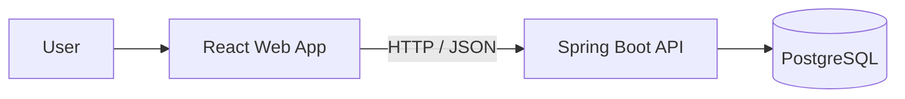

# 👔 Suit Rental Manager Web

<p align="center">
  A web dashboard for managing customers, products, physical inventory, and formalwear rentals.
</p>

<p align="center">
  
  
  
  
</p>

<p align="center">
  <a href="https://suit-rental-manager-web.vercel.app"><strong>🌐 Open live app</strong></a>
  &nbsp;•&nbsp;
  <a href="https://github.com/branquinho91/suit-rental-manager-api"><strong>⚙️ View API</strong></a>
</p>

<p align="center">
  <a href="#-about-the-project">About</a> •
  <a href="#-features">Features</a> •
  <a href="#%EF%B8%8F-tech-stack">Tech stack</a> •
  <a href="#-getting-started">Getting started</a> •
  <a href="#-api-integration">Integration</a>
</p>

## ✨ About the project

**Suit Rental Manager** is a full-stack system designed to simplify the day-to-day operations of formalwear rental businesses. This application is the system's web interface, bringing customer and product registration, individual inventory control, and rental tracking together in a single dashboard.

The ecosystem is split into two repositories:

| Project | Repository | Responsibility |
| --- | --- | --- |
| **Web** | [suit-rental-manager-web](https://github.com/branquinho91/suit-rental-manager-web) | User interface and experience built with React |
| **API** | [suit-rental-manager-api](https://github.com/branquinho91/suit-rental-manager-api) | Business rules, persistence, and REST endpoints |

> The live application is available at [suit-rental-manager-web.vercel.app](https://suit-rental-manager-web.vercel.app).

## 🚀 Features

- **Customers** — registration and search by name, CPF, email, phone number, or city.
- **Products** — catalog with type, brand, size, color, price, and notes.
- **Inventory** — registration of physical items, individual codes, and availability tracking.
- **Rentals** — create rentals with one or more items and inspect their details.
- **Rental lifecycle** — complete or cancel active rentals.
- **Quick search** — dedicated filters on the customers, products, inventory, and rentals screens.
- **Visual feedback** — loading, error, empty-list, and no-results states throughout the app.
- **SPA navigation** — client-side routing with support for direct access when deployed to Vercel.

## 🛠️ Tech stack

| Technology | Purpose |
| --- | --- |
| [React 19](https://react.dev/) | Component-based user interface |
| [TypeScript 6](https://www.typescriptlang.org/) | Static typing and safer development |
| [Vite 8](https://vite.dev/) | Development server and production build |
| [React Router 7](https://reactrouter.com/) | Navigation between application screens |
| [ESLint](https://eslint.org/) | Code quality and consistency |
| [Vercel](https://vercel.com/) | Web application hosting |

## 🧩 Architecture



On the frontend, responsibilities are separated into pages, reusable components, integration services, types, and utility functions.

## 🏁 Getting started

### Prerequisites

- [Node.js](https://nodejs.org/) on a current LTS release
- [npm](https://www.npmjs.com/)
- [Suit Rental Manager API](https://github.com/branquinho91/suit-rental-manager-api) running locally or remotely

### 1. Clone the project

```bash
git clone https://github.com/branquinho91/suit-rental-manager-web.git
cd suit-rental-manager-web
```

### 2. Install the dependencies

```bash
npm install
```

### 3. Start the API

Follow the instructions in the [API repository](https://github.com/branquinho91/suit-rental-manager-api) and keep the backend running at `http://localhost:8080`.

### 4. Start the frontend

```bash
npm run dev
```

Open the local address displayed by Vite in your terminal.

## 🔌 API integration

Requests use the URL defined in `VITE_API_URL`. When this variable is not set, the application uses `/api`, and Vite's development proxy forwards calls to `http://localhost:8080`.

### Local development

With the API running on port `8080`, you do not need to create an `.env` file:

```text
Frontend  http://localhost:5173
    │
    └── /api/*  ──proxy──▶  http://localhost:8080/*
```

### Remote API

Copy the example environment file to `.env`:

```bash
cp .env.example .env
```

Set the public API URL:

```env
VITE_API_URL=https://your-api.example.com
```

> [!IMPORTANT]
> Do not add a trailing slash to `VITE_API_URL`. In production, the frontend origin must also be allowed by the API's CORS configuration.

When the URL belongs to ngrok, the client automatically adds the header required to skip the service's browser warning page.

### Consumed endpoints

| Method | Endpoint | Usage in the interface |
| --- | --- | --- |
| `GET` | `/customers` | Lists customers |
| `POST` | `/customers` | Creates a customer |
| `GET` | `/products` | Lists products |
| `POST` | `/products` | Creates a product |
| `GET` | `/inventory-items` | Lists inventory items |
| `POST` | `/inventory-items` | Adds an inventory item |
| `GET` | `/rentals` | Lists rentals |
| `POST` | `/rentals` | Creates a rental |
| `PATCH` | `/rentals/{id}/complete` | Completes a rental |
| `PATCH` | `/rentals/{id}/cancel` | Cancels a rental |

The complete backend documentation is available in the [API README](https://github.com/branquinho91/suit-rental-manager-api#readme). With the API running locally, you can also browse its [Swagger UI](http://localhost:8080/swagger-ui.html).

## 📜 Available scripts

| Command | Description |
| --- | --- |
| `npm run dev` | Starts the Vite development server |
| `npm run build` | Type-checks the project and creates a production build |
| `npm run lint` | Runs ESLint across the project |
| `npm run preview` | Serves the production build locally |

## 📁 Project structure

```text
suit-rental-manager-web/
├── public/                 # Public assets
├── src/
│   ├── components/        # Shared UI, cards, buttons, and modals
│   ├── img/               # Application images
│   ├── pages/             # Main application screens
│   ├── services/          # HTTP client and domain services
│   ├── types/             # Domain types and API contracts
│   ├── utils/             # Formatting and helper functions
│   ├── App.tsx            # Layout and route configuration
│   ├── index.css          # Global styles
│   └── main.tsx           # Application entry point
├── .env.example           # API configuration example
├── vercel.json            # SPA routing and security headers
└── vite.config.ts         # Vite and local proxy configuration
```

## 🧭 Application routes

| Route | Screen |
| --- | --- |
| `/` | Home page |
| `/customers` | Customer management |
| `/products` | Product catalog |
| `/inventory` | Inventory control |
| `/rentals` | Rental management |

## 📦 Build and deployment

Create an optimized production build:

```bash
npm run build
```

The generated files will be available in `dist/`. To inspect the result locally:

```bash
npm run preview
```

The included `vercel.json` redirects application routes to `index.html`, allowing URLs managed by React Router to work correctly on Vercel. In the production environment, set `VITE_API_URL` to the backend's public address.

## 🤝 Contributing

1. Fork the project.
2. Create a branch: `git checkout -b feature/your-feature`.
3. Commit your changes: `git commit -m "feat: add your feature"`.
4. Push the branch: `git push origin feature/your-feature`.
5. Open a Pull Request.

---

<p align="center">
  Built to turn rental operations into a simple, traceable, and organized workflow. ✨
</p>
